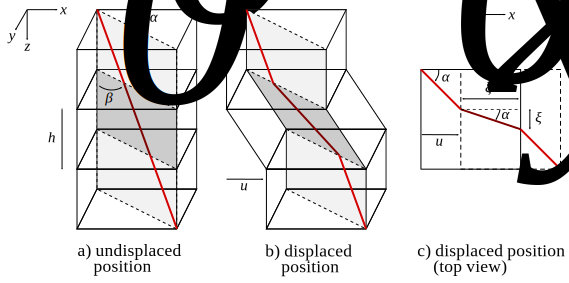
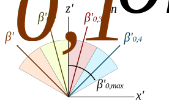
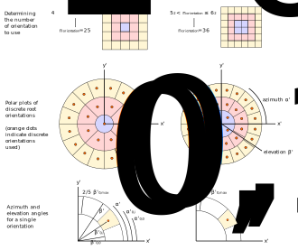
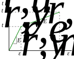

G. J. Meijer <gjm36@bath.ac.uk>
University of Bath, Department of Arhitecture and Civil Engineering, Bath BA2 7AY, 
May 2021

# Introduction

This web application was developed by Dr Gerrit Meijer. It provides a user-friendly version of the root-reinforcement model ('Dundee Root Analysis Model', acronym 'DRAM') described in full detail by @meijer2021dram. 

This root-reinforcement model accounts for the mobilisation of roots in direct shear conditions, accounting for:

* Elastoplastic root behaviour
* Three-dimensional orientations of roots
* Root slippage and root breakage mechanisms
* A shear zone that may increase in thickness during direct shear displacement, depending on the stresses in the soil

The function of this manual is to describe the user interface, and to explain the meaning of all inputs and output. For a detailed explanation of how the root-reinforcement model itself works, please see @meijer2021dram.

The model runs in 'R' (@r) and the user interface was created using the 'Shiny' package (@shiny). Plots are generated using 'Plotly' (@plotly). All plots are interactive, allowing the user to zoom in, zoom out, pan (in 3D plots), switch individual data series on/off, download plots etc.

# Input

This web application uses a simplified set of root and soil input parameters to quickly generate a series of root diameters, orientations etc. The required model input is inputted under several tabs:

* **Root diameters**: contains input for root diameters and the distribution of root volume fractions over all root diameter classes;
* **Root orientations**: contains input for generating root orientations;
* **Root properties**: contains input for describing root properties (length, tensile strength, stiffness etc.);
* **Soil properties**: contains input for soil properties and shear displacements (soil strength, stresses, shear zone thickness, shear displacements etc.).

Each of these tabs contains interactive plots (plotly) that automatically update when input values are changed, to help the user to visualise the input specified. 

## Unit system

The model works with a user-specified system of units, that can be defined on the 'Notes' tab. Units can be set for all:

* **Length scales** (e.g. root diameter, root length, shear displacement, shear zone thickness). Choices are millimeters [mm], centimeters [cm] or meters [m];
*	**Root stresses and strengths** (e.g. root tensile strength, root tensile stress, root stiffness). Choices are pascals [Pa] = [Nm^-2^], kilopascals [kPa], megapascals [MPa] or gigapascals [GPa].
* **Soil stresses and strengths** (e.g. soil stress, soil shear strength, root reinforcement, root-soil interface shear resistance). Choices are pascals [Pa]=[Nm^-2^], kilopascals [kPa], megapascals [MPa] or gigapascals [GPa].
* **Root strains** (e.g. the tensile strain in a root). Choices are dimensionless strain [-] (e.g. mm elongation per mm of original length) or percentages [%].
* **Root area ratios**. Choices are dimensionless area [-] (e.g. area of root per area of soil) or percentage [%].

In addition, a root reference diameter $d_{r,0}$ (`dr0`) has to be defined. Such a reference diameter is required for the various power-law relationships used in the model, for example to describe the relation between root diameter and root tensile strength.

All angles are expressed in degrees. 

**Please note** that when the unit system is *changed* midway using the application, all input parameters of that type are reset to their default values! It is therefore advisable to set the unit system before starting any calculations.

## Coordinate system

Coordinates and angles are expressed in a right-handed coordinate system, orientated in such a way that $x$ points in the direction of shear displacement $u_s$, and $z$ is normal to the shear plane, pointing in the direction of the displacing soil block, see Figure [@fig:coordsystem]. $h$ indicated the current thickness of the shear zone.

{width=80%}

The orientation of undisplaced roots is described in spherical coordinates; azimuth $\alpha_0$ (the angle between the $x$ axis and the orientation of the root projected on the $x$-$y$ plane) and elevation angle $\beta_0$ (angle between $z$-axis and root axis). The azimuth and elevation of the displaced root within the shear zone are indicated by $\alpha$ and $\beta$ respectively.

Transverse relative soil--root displacements are assumed zero, i.e. soil and root vectors that are parallel in the undeformed position are assumed to remain parallel in the deformed position. 

## Input tab: 'Root diameter'

### Root diameter classes

The range of discrete root diameters can be included in model calculations.
The user defines both the diameter of the smallest root $d_{r,min}$ and the diameter of the largest root $d_{r,max}$. This root diameter interval is split into $n_c$ discrete root diameter classes, each with the same width. The minimum and maximum diameter in each class $i$ ($i=1...n_d$) is given by:
\begin{equation}
	d_{r,min,i} = \frac{i-1}{n_c} \left( d_{r,max}-d_{r,min} \right)
\end{equation}
\begin{equation}
	d_{r,max,i} = \frac{i}{n_c} \left( d_{r,max}-d_{r,min} \right)
\end{equation}
and the average diameter $d_r$ in class $i$:
\begin{equation}
	d_{r,i} = \frac{1}{2} \left( d_{r,min,i} + d_{r,max,i} \right)
\end{equation}

{width=50%}

### Root area ratios

Root area ratios are described as the sum of cross-sectional areas of roots crossing the shear zone divided by the area of the shear zone. It is assumed that the relationship between root diameter $d_r$ and the root volume fraction described to each root diameter (on a continuous diameter scale) $\phi_r$ follows a power-law relationship:
\begin{equation}
	\phi_r = \phi_{r,0} \left( \frac{d_r}{d_{r,0}} \right)^{\beta_\phi}
	\label{eq:phirdr}
\end{equation}
where $\phi_{r,0}$ and $\beta_\phi$ are model constants and $d_{r,0}$ the root reference diameter defined under the `Notes' tab. When $\beta_\phi=0$, the root volume is equally spread over all root diameters. When $\beta_\phi>0$, larger roots take up most of the root volume, and when $\beta_\phi<0$, smaller roots take up the majority of the total root volume, see Figure \@ref(fig:rootvolumedistribution)b.

Instead of defining input parameter $\phi_{r,0}$, the total root volume fraction $\phi_{r,t}$ is defined instead. $\phi_{r,0}$ and $\phi_{r,t}$ are related since:
\begin{equation}
	\phi_{r,t} = \int_{x=d_{r,min}}^{d_{r,max}} \phi_r ~dx
\end{equation}
Rewriting $\phi_{r,0}$ in terms of $\phi_{r,t}$ gives:
\begin{equation}
	\phi_{r,0} = \begin{cases}
	\frac{\phi_{r,t} \left(1+\beta_\phi\right)}{d_{r,max}\left(\frac{d_{r,max}}{d_{r,0}}\right)^{\beta_\phi} - d_{r,min}\left(\frac{d_{r,min}}{d_{r,0}}\right)^{\beta_\phi}} & \text{when } \beta_\phi \neq -1 \\
	\frac{\phi_{r,t}}{d_{r,0} \ln{\left(\frac{d_{r,max}}{d_{r,min}}\right)}} & \text{when } \beta_\phi = -1 
	\end{cases}
\end{equation}

The root volume fraction that needs to be assigned to each root diameter class $i$ ($\phi_{r,i}$) is found by integration:
\begin{equation}
	\phi_{r,i} = \int_{x=d_{r,min,i}}^{d_{r,max,i}} \phi_r ~dx
\end{equation}

{width=50%}

## Input tab: 'Root orientations'

A range of root orientations can be defined. For every root diameter class, the distribution of root orientations is assumed to be uniform over the range of root orientations specified by the user. 

Initial root orientations are defined in a coordinate system $x'$-$y'$-$z'$ (spherical coordinates: $\alpha'_0$, $\beta'_0$) that is rotated by azimuth angle $\alpha_{offset}$ and elevation angle $\beta_{offset}$ with respect to coordinate system $x$-$y$-$z$, see Figure \@ref(fig:orientationoffset).

{width=50%}

The uniform distribution of roots over the specified domain is discretised using $n_{orientation}$ discrete root orientation classes. The range of root orientations can either be defined as varying in one dimension ($n_{dimension}=1$), two dimensions ($n_{dimension}=2$) or three dimensions ($n_{dimemsion}=3$). 

### 1-dimensional root orientations

When the 1-dimensional case is selected ($n_{dimension}=1$), only a single root  orientation is used with azimuth angle:

$$ \alpha'_{0,i} = 0^\circ$$

and elevation angle: 

$$\beta'_{0,i} = 0^\circ$$. 

This root orientation is therefore parallel to the $z'$-axis. Then $n_{dimension}=1$ is selected, $n_{orientation}$ automatically is assumed to be equal to 1.

The 'weight' indicates the fraction of roots that have a particular orientation. Since in the 1-D case there is only one root orientation, the weight for this orientation is:

$$ \text{weight}_i = 1 $$

### 2-dimensional root orientations

When the 2-dimensional case is selected ($n_{dimension}=2$), all roots are orientated in a single 2-D plane spanned by the $x'$ and $z'$-axis, in a 'fan' shape around the $z'$-axis . The maximum elevation angle of the fan is given by input parameter $\beta'_{0,max}$ (`beta0max`). Root orientations are uniformly distributed along this fan. For orientation $i$ ($i=1...n_{orientation}$), the azimuth angle $\alpha'_0$ and elevation angle $\beta'_0$ are given by:
\begin{equation}
	\alpha'_{0,i} = 0
\end{equation}
\begin{equation}
	\beta'_{0,i} = \left[ \frac{2i-1}{n_{orientation}} - 1\right] \beta'_{0,max}
\end{equation}

{width=50%}

Each orientation is given the same 'weight'. The weight indicates the fraction of roots that has this particular orientation:

$$ \text{weight}_i = \frac{1}{n_{orientation}} $$

### 3-dimensional root orientations

When the 3-dimensional case is selected ($n_{dim}=3$), roots are orientated in three dimensional space. Root orientations are assumed uniformly distributed over a spherical cap, described by the domain $-180^\circ \leq \alpha'_0 < 180^\circ$ and $0 \leq \beta'_0 \leq \beta'_{0,max}$. This domain is discretised in the following manner:

1. Round the number of requested root orientation upwards towards the nearest integer square root. For example, when 21 orientations are requested: 

    $$ 4^2 < 21 \leq 5^2 \longrightarrow n_{orientation} = 5^2 = 25 $$
    
2. Seperate all points over a number of 'bands', see figure below. Each band has the same 'thickness' in terms of elevation $\beta'$. This results in a number of grid cells, each bound by an upper and a lower azimuth angle ($\alpha'_{0,0}$ and $\alpha'_{0,1}$) and an upper and a lower elevation angle ($\beta'_{0,0}$ and $\beta'_{0,1}$).

3. For each cell, calculate the relative area of the spherical cap occupied by this grid cell (this is referred to as the 'weight'). With the assumption that roots are uniformly distributed across the spherical cap, this 'weight' is equal to the fraction of roots with this orientation:

    $$ \text{weight}_i = \frac{\left(\alpha'_{0,1}-\alpha'_{0,0}\right) \left( \cos{\beta'_{0,1}}-\cos{\beta'_{0,0}} \right) }{ 2 \pi \left(1 - \cos{\beta'_{0,max}} \right) } $$

    The sum of all weights equals 1.

4. Each cell $i$ is assigned a discrete, representative orienation ($\alpha'_{0,i}$, $\beta'_{0,i})$ that is used in the model. This position is defined as the weighted midpoint of the cell in terms of area.

    All cells are symmetrical, and therefore the representative azimuth $\alpha'_{0,i}$:

    $$ \alpha'_{0,i} = \frac{\alpha'_{0,0} + \alpha'_{0,1}}{2} $$
    
    The representative elevation angle for each cell $i$ ($\beta'_{0,i}$) is found by finding the centre of 'mass' (in terms of elevation), to account for the fact that cells taper nearer the apex of the spherical cap:

    $$ \beta'_{0,i} = \frac{1}{A}\int_{\text{cell area A}} \beta' ~dA $$
    
    Solving this gives:
    
    $$ \beta'_{0,i} = \frac{\sin{\beta'_{0,1}} - \beta'_{0,1} \cos{\beta'_{0,1}} - \left(\sin{\beta'_{0,0}} - \beta'_{0,0} \cos{\beta'_{0,0}} \right) }{\cos{\beta'_{0,0}}-\cos{\beta'_{0,1}}} $$

The figure below gives a schematic representation of this approach:

{width=100%}

### Root area ratio correction

The root area ratio is given on a *plane*, while root orientations are defined in terms of root *quantities/volumes*. The same amount of roots growing relatively parallel to the shear plane do contribute much less to the root area ratio on the shear plane compared to roots being more perpendicular to the shear plane. In general, the relation between the root area ratio and the root volume ratio for a single root orientation $i$ satisfies:

$$ \frac{\text{Root area ratio}_i}{\text{Root volume ratio}_i} = \cos{\beta_{0,i}} $$
where $\beta_{0,i}$ is the angle between the initial root orientation and the normal to the shear plane for root $i$.

The model assumed the (total) root area ratio on the shear plane is known (input parameter $\phi_{r,t}$). After the initial root orientations have been transformed to the coordinate system of the shear plane ($\alpha'_0, \beta'_0 \longrightarrow \alpha_0, \beta_0$), the root area ratio is distributed over each orientation. For each orientation $i$, the assigned root area ratio that is assined to this orientation ($\phi_{r,i}$) equals:
$$ \phi_{r,i} = \phi_{r,t} \frac{\text{weight}_i \cos{\beta_{0,i}}}{\sum_i{\text{weight}_i \cos{\beta_{0,i}}}} $$
This procedure ensures that the (total) root area ratio is maintained, while at the same time the assumption of a uniform distribution of roots over a specific 1-D, 2-D or 3-D domain is maintained.

## Input tab: `Root properties'

On this input tab, root properties such as root length and their biomechanical behaviour are defined.

The root tensile strength $t_{r,u}$ is modelled as varying as function of root diameter $d_r$ by means of a power-law function:
\begin{equation}
	t_{r,u} = t_{r,u,0} \left( \frac{d_r}{d_{r,0}} \right)^{\beta_t}
	\label{eq:tru}
\end{equation}
where $t_{r,u,0}$ is the tensile strength of roots with a diameter $d_r=d_{r,0}$, $\beta_t$ a dimensionless power coefficient. Although often ignored, the reference diameter $d_{r,0}$ should always be specified to maintain a consistent system of units. The magnitude of the root reference diameter is set under the 'Notes' tab.

Another power-law function is used to describe the tensile strain to failure $\epsilon_{r,u}$ as function of root diameter $d_r$:
\begin{equation}
	\epsilon_{ru} = \epsilon_{r,u,0} \left( \frac{d_r}{d_{r,0}} \right)^{\beta_\epsilon}
	\label{eq:eru}
\end{equation}
where $\epsilon_{r,u,0}$ is the tensile strain to failure of roots with a diameter $d_r=d_{r,0}$, and $\beta_\epsilon$ a dimensionless power coefficient.

Similarly, a power-law is used to describe the root length $L_r$ as function of root diameter $d_r$:
\begin{equation}
	L_r = L_{r,0} \left( \frac{d_r}{d_{r,0}} \right)^{\beta_L}
\end{equation}
where $L_{r,0}$ is the root length of roots with a diameter $d_r=d_{r,0}$, and $\beta_L$ a dimensionless power coefficient.

Roots are modelled as elastoplastic, where $t_{r,y}$ is the yield tensile strength and $\epsilon_{r,y}$ the yield tensile strain, see Figure \@ref(fig:tensilestressstrain). The (elastic) Young's modulus $E_{r,e}$ equals:
\begin{equation}
	E_{r,e} = \frac{t_{r,y}}{\epsilon_{r,y}}
	\label{eq:ere}
\end{equation}
and the elastoplastic stiffness $E_{r,ep}$:
\begin{equation}
	E_{r,ep} = \frac{t_{r,u} - t_{r,y}}{\epsilon_{r,u} - \epsilon_{r,y}}
	\label{eq:erep}
\end{equation}
The yield tensile stress $t_{r,y}$ and yield strain $\epsilon_{r,y}$ are inputted in the model as fractions of tensile strength $t_{r,u}$ and tensile strain to failure $\epsilon_{r,u}$ respectively, using (dimensionless) parameters $t_{r,y}/t_{r,u}$ and $\epsilon_{r,y}/\epsilon_{r,u}$.

{width=50%}

The evolution of root tensile stress as function of tensile strain, ignoring any root breakage effects, can be described as:
\begin{equation}
	t_{r}
	\begin{cases}
		E_{r,e} \epsilon_r & \text{when } \epsilon_r \leq \epsilon_{r,y} \\
		t_{r,y} + E_{r,ep} \left(\epsilon_r - \epsilon_{r,y} \right) & \text{when } \epsilon_r > \epsilon_{r,y}
	\end{cases}
	\label{eq:tri}
\end{equation}

From these equations, it follows that the elastic and elastoplastic root stiffnesses $E_{r,e}$ and $E_{r,ep}$ can be rewritten in terms of root diameter $d_r$ using a power law relationship:
\begin{equation}
	E_{r,e} = \frac{\left(t_{r,y}/t_{r,u}\right)}{\left(\epsilon_{r,y}/\epsilon_{r,u}\right)} \frac{t_{r,u,0}}{\epsilon_{r,u,0}} \left(\frac{d_r}{d_{r,0}}\right)^{\beta_t - \beta_\epsilon}
\end{equation}
\begin{equation}
	E_{r,ep} = \frac{\left(1 - t_{r,y}/t_{r,u}\right)}{\left(1 - \epsilon_{r,y}/\epsilon_{r,u}\right)} \frac{t_{r,u,0}}{\epsilon_{r,u,0}} \left(\frac{d_r}{d_{r,0}}\right)^{\beta_t - \beta_\epsilon}
\end{equation}

It is known that the biomechanical properties of roots can vary widely, not only between roots with different diameters, but also for roots with the \textit{same} diameter. To include the latter variability in the model, a root breakage parameter $f_{b}$ was included, such that $f_{b}=1$ when all root is intact, and $f_{b}=0$ when all root is broken. 

The Weibull breakage function is used to define the breakage parameter $f_{b}$, similar to \citet{schwarz2013}:
\begin{equation}
	f_{b} = -\exp \left[-\left( \frac{t_{r}}{\lambda_t} \right)^{\kappa_t} \right]
\end{equation}
where $\kappa_t$ is the (dimensionless) Weibull shape parameter and $\lambda_t$ the (dimensionless) Weibull scale parameter, which is related to the average root strength $t_{ru}$:
\begin{equation}
	\lambda_t = \frac{t_{r,u}}{\Gamma(1 + 1/\kappa_t)}
	\label{eq:weibullshaperelation}
\end{equation}
where $\Gamma$ is the Gamma-function.

If elastic root behaviour is required in the model instead of elastoplastic root behaviour, simply ensure that input parameters $t_{r,y}/t_{r,u} = \epsilon_{r,y}/\epsilon_{r,u}$. 

## Input tab: `Soil properties'

On this input tab, soil properties, root-soil interface properties, shear zone properties and direct shear displacements are defined. 

The soil shear strength $\tau_{s,u}$ is described using the Mohr-Coulomb failure criterion:
\begin{equation}
	\tau_{s,u} = c' + \sigma'_n \tan\phi'
\end{equation}
where $c'$ is the (apperent) soil cohesion, $\phi'$ the soil angle of internal friction and $\sigma'_n$ the soil effective normal stress acting on the shear zone (positive in compression).

The maximum root--soil interface shear resistance is described by $\tau_i$. Full interface friction between soil and root is assumed in the model as soon as there is differential displacement between soil and root (rigid perfectly-plastic behaviour).

The initial thickness $h$ of the shear zone is inputted into the model through model parameter $h_0$. In geotechnical engineering, this is often assumed in the order of 10 to 20 average soil particle diameters (e.g. @oda1999). A maximum shear zone thickness $h_{max}$ can also be specified, for example when modelling a case where the shear zone thickness may be limited by boundary conditions. If there is no constraint, simply set $h_{max}$ equal to a large value.

The maximum direct shear deformation $u$ applied in the model is described by parameter $u_{s,max}$. The shear displacement interval is split into $n_{step}$ number of uniformly spaced shear displacement steps. The shear displacement in step $i$ ($i=1...n_{step}$) is given by:
\begin{equation}
	u_{s,i} = \frac{i}{n_{step}} u_{s,max}
\end{equation}

It should be noted that the case $h = h_0 = h_{max} = 0$ is equivalent with modelling the opening of a tensile crack, for example at the crown of a landslide. In this case, $u_s$ now signifies the crack width, and $u_{s,max}$ the maximum crack width considered.

# Output

Output is provided on two output tabs:

* 'Calculate': On this tab, calculations using the DRAM are performed and the results plotted; 
*	'Comparison to existing models': On this tab, root-reinforcements are calculated using other existing root-reinforcement models (using the same input parameters as used in the DRAM).

## Output tab: 'Calculate'

Calculations for the Dundee Root Model are started by pressing the button `Start calculations'.

Calculation progress is indicated in the lower-right corner of the screen.
Once finished, three (interactive) plots will appear:

*	**Shear displacement--root reinforcement plot**: Plots the calculated root-reinforcement $c_r$ as function of direct shear displacement $u_s$, as calculated by the DRAM. The peak root-reinforcements $c_{r,u}$ and the corresponding shear displacement are indicated on the plot;
* **Shear displacement--shear zone thickness plot**: Plots the evoluation of the thickness of the shear zone ($h$) as function of shear displacement ($u_s$);
* **Shear displacement--root fraction plot**. This stacked area plot indicates the fractions of the total root volume of roots behaving elastic, elastoplastic, anchored, slipping, broken etc., as function of shear displacement $u_s$. This plots should give some insight of what the dominant type of root behaviour is throughout the test.

In addition, four comma-separated data files (`.csv`) can be downloaded. 

* **Input parameters**: Contains a list of all input parameters, units and values fed into the model:

    * `phirt`: total root volume fraction $\phi_{r,t}$
    * `betaphi`: root volume distribution power coefficient $\beta_\phi$
    * `nc`: number of discrete root diameter classes $n_c$
    * `drmin`: minimum root diameter $d_{r,min}$
    * `drmax`: mazimum root diameter $d_{r,min}$
    * `norientation`: requested number of discrete root orientations $n_{orientation}$
    * `norientation_used`: number of discrete root orientations used by the model
    * `ndimension`: number of root orientation dimension $n_{dimension}$
    * `beta0max`: maximum root elevation angle $\beta'_{0,max}$, in $x'$-$y'$-$z'$ coordinate system
    * `alphaoffset`: azimuth angle offset $\alpha_{offset}$ between $x'$-$y'$-$z'$ and $x$-$y$-$z$ coordinate systems
    * `beta0offset`: elevation angle offset $\beta_{offset}$ between $x'$-$y'$-$z'$ and $x$-$y$-$z$ coordinate systems
    * `dr0`: reference root diameter $d_{r,0}$
    * `tru0`: root tensile strength $t_{r,u,0}$ for roots with diameter $d_r=d_{r,0}$
    * `betat`: root diameter--tensile strength power coefficient $\beta_t$
    * `epsru0`: root tensile strain to failure $\epsilon_{r,u,0}$ for roots with diameter $d_r=d_{r,0}$
    * `betaeps`: root diameter--tensile strain to failure power coefficient $\beta_\epsilon$
    * `Lr0`: root length $L_{r,0}$ for roots with diameter $d_r=d_{r,0}$
    * `betaL`: root diameter--root length power coefficient $\beta_L$
    * `trytru`: ratio $t_{r,y}/t_{r,u}$ between root yield strength and tensile strength
    * `epsryepsru`: ratio $\epsilon_{r,y}/\epsilon_{r,u}$ between root yield strain and strain to failure
    * `c` soil (apparent) cohesion $c'$
    * `phi`: soil angle of internal friction $\phi'$    
    * `sign`: effective normal soil stress $\sigma'_n$ on the shear plane     
    * `h0`: initial shear zone thickness $h_0$
    * `hmax`: maximum shear zone thickness $h_{max}$
    * `taui`: maximum root--soil interface shear resistance $\tau_i$
    * `usmax`: maximum shear displacement $u_{s,max}$ considered in the model
    * `nstep`: number of discrete shear displacement steps $n_{step}$

* **All root orientations and properties**: Contains a list of all roots considered (all combinations of discrete root diameters, root properties and root orientations). The `.csv` file contains the following headers

    * `rootID`: a unique identifying integer assigned to each combination of root properties
    * `drmin`: the minimum diameter of the root class
    * `drmax`: the maximum diameter of the root class
    * `dr`: the average diameter in the root class
    * `Lr`: root length
    * `tru`: root tensile strength
    * `try`: root yield strength
    * `epsru`: root tensile strain to failure
    * `epsry`: root tensile strain to yield
    * `kappat`: Weibull shape parameter for survival function
    * `Ere`: root elastic tensile stiffness
    * `Erep` root elastoplastic tensile stiffness
    * `alpha0`: azimuth angle of initial root orientation
    * `beta0`: elevation angle of initial root orientation
    * `phir`: root area ratio assigned to root class

* **Results per displacement step**: Contains summary of results for each displacement step. This file can only be downloaded after the calculations have finished.

    * `stepID`: a unique identifying integer assigned to each displacement step
    * `us`: Current direct shear displacement $u_s$
    * `h`: Current shear zone thickness $h$
    * `cr`: Current root-reinforcement $c_r$;
    * `fraction_notintension`: The fraction of the total root volume of roots currently not loaded in tension or fully positioned within the shear zone
    * `fraction_anchoredelastic`: The fraction of the total root area ratio that currently behave anchored and linear elastic
    * `fraction_anchoredelastoplastic`: The fraction of the total root area ratio that currently behave anchored and elastoplastic;
    * `fraction_slipelastic`: The fraction of the total root area ratio that currently slip and behave linear elastic;
    * `fraction_slipelastoplastic`: The fraction of the total root area ratio that currently slip and behave elastoplastic;
    * `fraction_broken`: The fraction of the total root area ratio that are currently broken;
    
    
* **Results per displacement step and per root**: Contains summary of results for each displacement step and each root. This file can only be downloaded after the calculations have finished.

    * `rootID`: root identifier, see 'All root orientations and properties'
    * `stepID`: soil displacement step identifier, see 'Results per displacement step'
    * `tr`: tensile stress in the root, assuming it never breaks ($t_{r,u} = \infty$)
    * `fb`: fraction of roots intact under the current tensile stress $t_r$ (`tr`)
    * `cr`: contribution to root reinforcement
    * `flag`: integer identifier indicating the current root type. `0`: roots not in tension, `1`: anchored elastic root behaviour, `2` anchored elastoplastic root behaviour, `3`: slipping elastic root behaviour, `4` slipping elastoplastic root behaviour

# References
